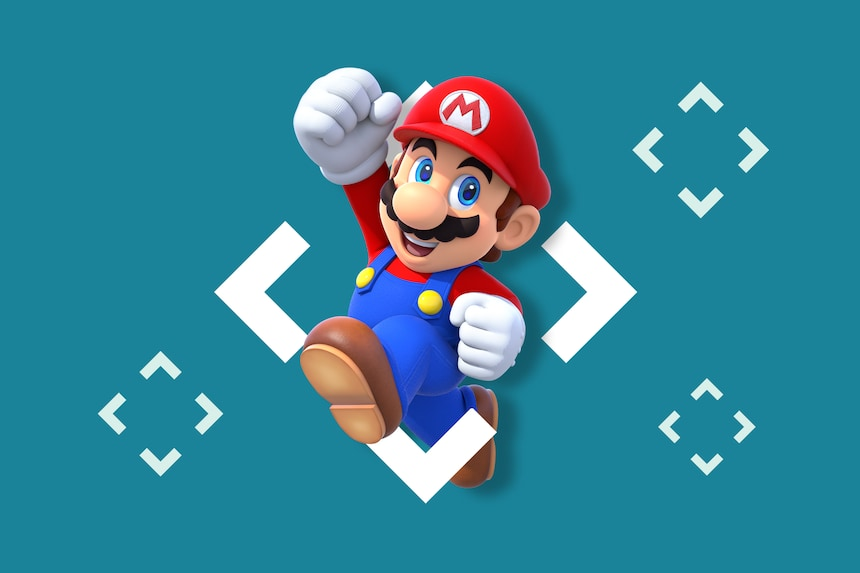

  
   
    😆 Hey! Welcome to my github page!
   
    I am Zihao Liu, a Fullstack developer from China, currently living in Boston, USA.

#### ⚡ Things I am currently working on | interested in ⚡:
- Startup web development: Frontend development for building cool web pages with React, CSS, Html etc.
- Backend development focused on performance.
- Rust programming.

------------
 
 
 

 

#### ⭐️ &nbsp;Tech Stack

------------

<!--
**ZihaoLiu0927/ZihaoLiu0927** is a ✨ _special_ ✨ repository because its `README.md` (this file) appears on your GitHub profile.

Here are some ideas to get you started:

- 🔭 I’m currently working on ...
- 🌱 I’m currently learning ...
- 👯 I’m looking to collaborate on ...
- 🤔 I’m looking for help with ...
- 💬 Ask me about ...
- 📫 How to reach me: ...
- 😄 Pronouns: ...
- ⚡ Fun fact: ...
-->
